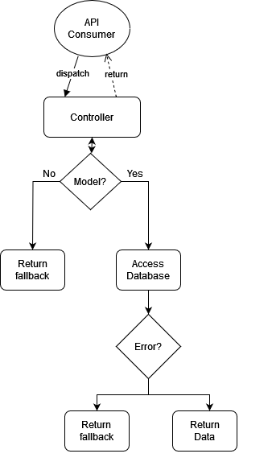

# External Documentation

---
This folder contains all the doc's for the api and how to configure your Scaffold 
application.

## Content's:
1. [Scaffold Cli](./cli.md)
2. [Components](component's.md)
3. [Good practices](good-practices.md)

## Flow Chart for Scaffold's API process
Scaffold has a simple yet effective process.
It starts with an API consumer making a request to a route with an attached controller. 
The controller first checks if it has an attached model. If it doesn't, it returns the fallback;
otherwise, it tries to retrieve data from the database 
and returns the fallback if it encounters an error.
---

